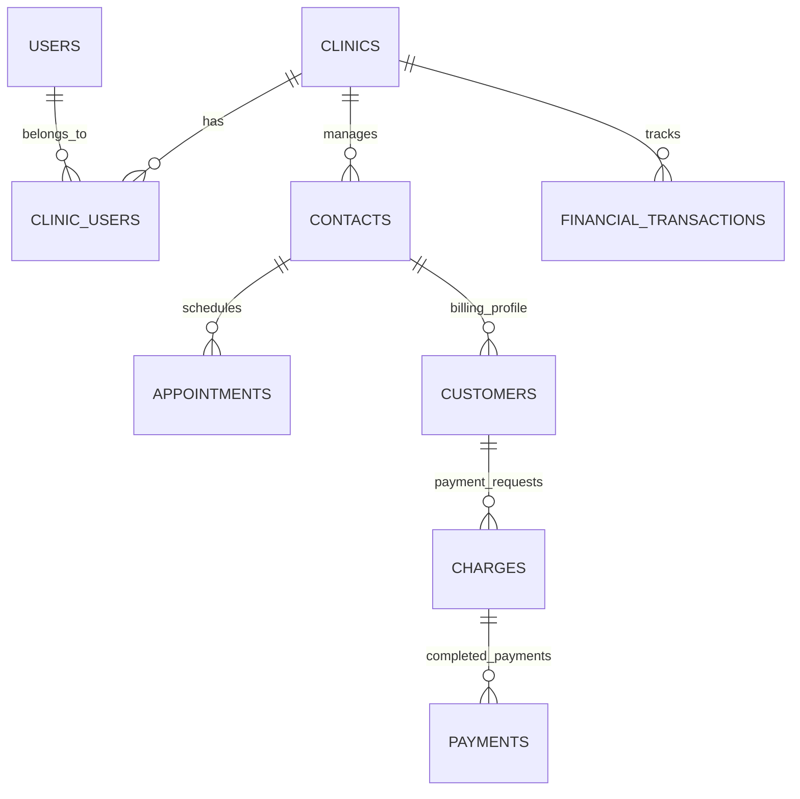
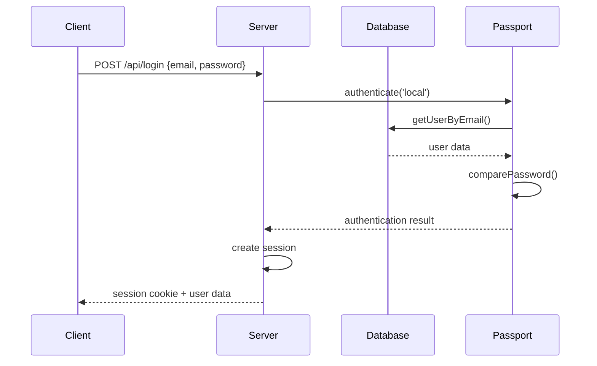

# System Architecture Documentation

## Overview

Taskmed is a multi-tenant healthcare management platform built with a modern full-stack architecture. The system is designed to handle multiple clinics as independent tenants while providing comprehensive patient management, financial operations, and AI-assisted workflows.

## High-Level Architecture

```
┌─────────────────┐    ┌─────────────────┐    ┌─────────────────┐
│   Frontend      │    │   Backend       │    │   Database      │
│   React/Vite    │◄──►│   Express/Node  │◄──►│   PostgreSQL    │
│   TypeScript    │    │   TypeScript    │    │   Drizzle ORM   │
└─────────────────┘    └─────────────────┘    └─────────────────┘
         │                        │                        │
         │                        │                        │
         ▼                        ▼                        ▼
┌─────────────────┐    ┌─────────────────┐    ┌─────────────────┐
│   External APIs │    │   Session Store │    │   File Storage  │
│   Asaas, Claude │    │   PostgreSQL    │    │   Local/Cloud   │
└─────────────────┘    └─────────────────┘    └─────────────────┘
```

## Application Layers

### 1. Presentation Layer (Frontend)

**Technology Stack:**
- React 18 with TypeScript
- Vite for build tooling
- TailwindCSS + shadcn/ui for styling
- Wouter for routing
- TanStack Query for state management

**Key Components:**

```typescript
// Layout Structure
├── Layout.tsx              // Main application shell
│   ├── Header.tsx          // Top navigation and user menu
│   ├── Sidebar.tsx         // Main navigation menu
│   └── [Page Components]   // Route-specific content

// Page Components
├── dashboard.tsx           // Analytics overview
├── contatos.tsx           // Patient management
├── contato-detalhes.tsx   // Patient detail view
├── consultas.tsx          // Appointment management
├── financeiro.tsx         // Financial management
├── pipeline.tsx           // Sales/CRM pipeline
├── conversas.tsx          // Communication hub
├── relatorios.tsx         // Reporting system
└── configuracoes.tsx      // Settings management
```

**State Management Pattern:**
```typescript
// Server State (TanStack Query)
const { data: contacts } = useQuery({
  queryKey: ["/api/contacts"],
  queryFn: getQueryFn(),
});

// Local State (React Hooks)
const [isEditing, setIsEditing] = useState(false);

// Form State (React Hook Form + Zod)
const form = useForm({
  resolver: zodResolver(contactSchema),
  defaultValues: { name: "", email: "" }
});
```

### 2. Business Logic Layer (Backend)

**Technology Stack:**
- Node.js with Express.js
- TypeScript for type safety
- Passport.js for authentication
- Express Session for session management

**Key Modules:**

```typescript
// Authentication & Authorization
├── auth.ts                 // Passport configuration
├── replitAuth.ts          // OAuth integration (optional)
└── middleware/
    ├── isAuthenticated     // Session validation
    └── hasClinicAccess     // Multi-tenant security

// Data Access Layer
├── storage.ts             // Storage interface definition
├── postgres-storage.ts    // PostgreSQL implementation
└── db.ts                  // Database connection

// External Integrations
├── asaas-service.ts       // Payment processing
└── anthropic-service.ts   // AI assistant (planned)

// API Routes
└── routes.ts              // RESTful endpoint definitions
```

### 3. Data Access Layer

**Database Design Principles:**
- Multi-tenant architecture with clinic isolation
- Normalized schema with proper relationships
- Indexed columns for performance
- JSONB for flexible metadata storage

**Storage Pattern:**
```typescript
// Interface-based design for flexibility
interface IStorage {
  getContacts(clinicId: number): Promise<Contact[]>;
  createContact(contact: InsertContact): Promise<Contact>;
  // ... other methods
}

// PostgreSQL implementation
class PostgreSQLStorage implements IStorage {
  async getContacts(clinicId: number): Promise<Contact[]> {
    return await db.select()
      .from(contacts)
      .where(eq(contacts.clinic_id, clinicId));
  }
}
```

## Multi-Tenancy Implementation

### Clinic Isolation Strategy

**Database Level:**
```sql
-- Every table includes clinic_id for tenant isolation
CREATE TABLE contacts (
  id SERIAL PRIMARY KEY,
  clinic_id INTEGER NOT NULL REFERENCES clinics(id),
  name TEXT NOT NULL,
  -- ... other fields
);

-- Indexes for performance
CREATE INDEX idx_contacts_clinic ON contacts(clinic_id);
```

**Application Level:**
```typescript
// Middleware enforces clinic access
export const hasClinicAccess = (paramName = 'clinicId') => {
  return async (req: any, res: any, next: any) => {
    const clinicId = parseInt(req.params[paramName]);
    const hasAccess = await storage.userHasClinicAccess(req.user.id, clinicId);
    
    if (!hasAccess) {
      return res.status(403).json({ error: "Access denied" });
    }
    
    req.clinicId = clinicId;
    next();
  };
};
```

### User-Clinic Relationships

```typescript
// Many-to-many relationship with roles
interface ClinicUser {
  id: number;
  clinic_id: number;
  user_id: number;
  role: string;           // 'admin', 'doctor', 'staff'
  permissions: object;    // Granular permissions
  is_active: boolean;
}
```

## API Design Patterns

### RESTful Conventions

```typescript
// Resource-based URLs with consistent patterns
GET    /api/contacts              // List resources
POST   /api/contacts              // Create resource
GET    /api/contacts/:id          // Get specific resource
PUT    /api/contacts/:id          // Update resource
DELETE /api/contacts/:id          // Delete resource

// Nested resources
GET    /api/contacts/:id/appointments  // Related resources
```

### Error Handling Strategy

```typescript
// Consistent error response format
interface ApiError {
  error: string;
  details?: any;
  code?: string;
}

// Global error handler
app.use((err: any, req: Request, res: Response, next: NextFunction) => {
  console.error('API Error:', err);
  res.status(err.status || 500).json({
    error: err.message || 'Internal server error',
    ...(process.env.NODE_ENV === 'development' && { stack: err.stack })
  });
});
```

### Request Validation

```typescript
// Zod schema validation
const createContactSchema = z.object({
  name: z.string().min(1),
  phone: z.string().min(10),
  email: z.string().email().optional(),
  clinic_id: z.number()
});

// Middleware usage
app.post('/api/contacts', validateRequest(createContactSchema), async (req, res) => {
  // Request body is now type-safe and validated
});
```

## Database Schema Design

### Core Entity Relationships



### Table Relationships

**Users & Authorization:**
```sql
users → clinic_users ← clinics
users → clinic_invitations ← clinics
```

**Patient Management:**
```sql
clinics → contacts → appointments
contacts → customers → charges → payments
```

**Financial Operations:**
```sql
clinics → financial_transactions
clinics → financial_reports
customers → subscriptions
```

**Pipeline/CRM:**
```sql
clinics → pipeline_stages → pipeline_opportunities
pipeline_opportunities → pipeline_history
pipeline_opportunities → pipeline_activities
```

## Security Architecture

### Authentication Flow



### Authorization Middleware Stack

```typescript
// Middleware chain for protected routes
app.get('/api/contacts',
  isAuthenticated,           // Verify session
  hasClinicAccess(),         // Verify clinic membership
  validatePermissions('read_contacts'),  // Check granular permissions
  contactController.list     // Business logic
);
```

### Data Security Measures

**Input Sanitization:**
```typescript
// Zod validation prevents injection attacks
const sanitizedData = contactSchema.parse(req.body);
```

**SQL Injection Prevention:**
```typescript
// Drizzle ORM uses parameterized queries
const contacts = await db.select()
  .from(contacts)
  .where(eq(contacts.clinic_id, clinicId));  // Safe parameterization
```

**Session Security:**
```typescript
// Secure session configuration
app.use(session({
  secret: process.env.SESSION_SECRET,
  resave: false,
  saveUninitialized: false,
  cookie: {
    secure: process.env.NODE_ENV === 'production',
    httpOnly: true,
    maxAge: 24 * 60 * 60 * 1000  // 24 hours
  }
}));
```

## Performance Considerations

### Database Optimization

**Indexing Strategy:**
```sql
-- Primary indexes for tenant isolation
CREATE INDEX idx_contacts_clinic ON contacts(clinic_id);
CREATE INDEX idx_appointments_clinic ON appointments(clinic_id);
CREATE INDEX idx_charges_clinic ON charges(clinic_id);

-- Composite indexes for common queries
CREATE INDEX idx_appointments_clinic_date ON appointments(clinic_id, scheduled_date);
CREATE INDEX idx_charges_clinic_status ON charges(clinic_id, status);
```

**Query Optimization:**
```typescript
// Efficient pagination
const contacts = await db.select()
  .from(contacts)
  .where(eq(contacts.clinic_id, clinicId))
  .limit(pageSize)
  .offset(page * pageSize)
  .orderBy(desc(contacts.created_at));
```

### Frontend Performance

**Code Splitting:**
```typescript
// Lazy loading for routes
const FinanceiroPage = lazy(() => import('./pages/financeiro'));
const ContactsPage = lazy(() => import('./pages/contatos'));
```

**Query Optimization:**
```typescript
// Efficient data fetching with TanStack Query
const { data: contacts } = useQuery({
  queryKey: ["/api/contacts", { page, search }],
  queryFn: getQueryFn(),
  staleTime: 5 * 60 * 1000,  // 5 minutes
  cacheTime: 10 * 60 * 1000, // 10 minutes
});
```

## Scalability Architecture

### Horizontal Scaling Considerations

**Stateless Design:**
- Session data stored in database, not memory
- No file uploads to local filesystem
- Environment-based configuration

**Database Scaling:**
```typescript
// Connection pooling for high concurrency
const pool = new Pool({
  connectionString: process.env.DATABASE_URL,
  max: 20,                    // Maximum connections
  idleTimeoutMillis: 30000,   // Close idle connections
  connectionTimeoutMillis: 2000,
});
```

**Caching Strategy:**
```typescript
// Redis integration for session storage (production)
const RedisStore = connectRedis(session);
app.use(session({
  store: new RedisStore({ client: redisClient }),
  // ... other options
}));
```

### Monitoring and Observability

**Logging Strategy:**
```typescript
// Structured logging
import winston from 'winston';

const logger = winston.createLogger({
  level: 'info',
  format: winston.format.combine(
    winston.format.timestamp(),
    winston.format.json()
  ),
  transports: [
    new winston.transports.File({ filename: 'error.log', level: 'error' }),
    new winston.transports.File({ filename: 'combined.log' })
  ]
});
```

**Health Checks:**
```typescript
// Application health endpoint
app.get('/health', async (req, res) => {
  try {
    await db.raw('SELECT 1');  // Database connectivity
    res.json({ status: 'healthy', timestamp: new Date() });
  } catch (error) {
    res.status(503).json({ status: 'unhealthy', error: error.message });
  }
});
```

This architecture documentation provides developers with a comprehensive understanding of the system's design principles, implementation patterns, and scalability considerations.