# Conversas Feature - Frontend Documentation

## Table of Contents

1. [Architecture Overview](#architecture-overview)
2. [Layout System](#layout-system)
3. [Component Architecture](#component-architecture)
4. [State Management](#state-management)
5. [Messaging System](#messaging-system)
6. [Styling Approach](#styling-approach)
7. [Technical Details](#technical-details)
8. [Implementation Decisions](#implementation-decisions)
9. [Data Structure](#data-structure)
10. [Future Considerations](#future-considerations)
11. [API Reference](#api-reference)
12. [Troubleshooting](#troubleshooting)

---

## Architecture Overview

### Technology Stack

- **Framework**: React 18 with TypeScript
- **Build Tool**: Vite
- **Styling**: Tailwind CSS with shadcn/ui components
- **Routing**: Wouter for client-side routing
- **State Management**: React useState/useEffect hooks
- **Icons**: Lucide React icons
- **Layout**: CSS Flexbox for responsive design

### Design Patterns

- **Component Composition**: Modular components with clear separation of concerns
- **Container/Presenter Pattern**: Layout components manage state, UI components handle presentation
- **Custom Hooks**: State logic extracted into reusable hooks where applicable
- **Responsive-First Design**: Mobile-first approach with progressive enhancement

### Folder Structure

```
client/src/
├── components/
│   └── features/
│       └── conversas/
│           ├── ConversasLayout.tsx          # Main layout container
│           ├── ConversationsSidebar.tsx     # Left panel - conversations list
│           ├── MainConversationArea.tsx     # Center panel - chat interface
│           ├── PatientInfoPanel.tsx         # Right panel - patient info
│           ├── MessageBubble.tsx            # Individual message component
│           └── EventMarker.tsx              # System event marker
├── types/
│   └── conversations.ts                     # TypeScript interfaces
├── lib/
│   └── mock-data.ts                        # Mock data and utilities
└── pages/
    └── conversas.tsx                       # Route entry point
```

### Entry Points

- **Route**: `/conversas` - Main conversations interface
- **Component**: `ConversasLayout` - Primary layout orchestrator
- **Page**: `client/src/pages/conversas.tsx` - Route handler

---

## Layout System

### Three-Panel Structure (25% | 50% | 25%)

The layout implements a flexible three-panel design:

```typescript
// Desktop layout (1200px+)
<div className="h-full flex bg-gray-50">
  {/* Conversations Sidebar - 25% */}
  <div className="w-1/4 min-w-[300px] border-r border-gray-200">
    <ConversationsSidebar />
  </div>
  
  {/* Main Conversation Area - 50% */}
  <div className="flex-1 min-w-0 relative h-full">
    <MainConversationArea />
  </div>
  
  {/* Patient Info Panel - 25% */}
  <div className="w-1/4 min-w-[280px] border-l border-gray-200">
    <PatientInfoPanel />
  </div>
</div>
```

### Responsive Strategy

**Breakpoints:**
- **Mobile**: < 768px - Single panel with navigation
- **Tablet**: 768px - 1200px - Two panels + drawer for patient info
- **Desktop**: 1200px+ - Full three-panel layout

**Implementation:**
```typescript
const [isMobile, setIsMobile] = useState(false);
const [isTablet, setIsTablet] = useState(false);

useEffect(() => {
  const checkScreenSize = () => {
    const width = window.innerWidth;
    setIsMobile(width < 768);
    setIsTablet(width >= 768 && width < 1200);
  };
  
  checkScreenSize();
  window.addEventListener('resize', checkScreenSize);
  return () => window.removeEventListener('resize', checkScreenSize);
}, []);
```

### Viewport Management

**Critical Fix**: The viewport height issue was resolved using `h-full` instead of `h-screen`:

```typescript
// Layout container uses h-full for proper viewport management
<div className="h-full flex bg-gray-50">
  {/* Message area with flex-1 grows to fill available space */}
  <div className="flex-1 overflow-y-auto">
    {/* Messages */}
  </div>
  
  {/* Input area fixed at bottom */}
  <div className="flex-shrink-0 bg-white border-t border-gray-200 p-4">
    {/* Input components */}
  </div>
</div>
```

### Scroll Implementation

Each panel has independent scroll behavior:
- **Sidebar**: `overflow-y-auto` for conversation list
- **Main Area**: Flex layout with growing message area and fixed input
- **Patient Info**: `overflow-y-auto` for patient details

---

## Component Architecture

### Component Hierarchy

```
ConversasLayout (Root)
├── ConversationsSidebar
│   ├── Search Input
│   └── Conversation List Items
├── MainConversationArea
│   ├── Message Timeline
│   │   ├── MessageBubble (multiple)
│   │   └── EventMarker (multiple)
│   └── Input System
│       ├── Reply/Note Toggle
│       ├── Message Input
│       └── Action Buttons
└── PatientInfoPanel
    ├── Patient Header
    ├── Recent Appointments
    └── Contact Information
```

### Main Components

#### ConversasLayout.tsx
**Purpose**: Main orchestrator managing responsive behavior and state coordination

```typescript
interface ConversasLayoutProps {
  // No external props - self-contained
}

// Key responsibilities:
// - Responsive layout management
// - Conversation selection state
// - Timeline data coordination
// - Auto-selection of first conversation
```

#### ConversationsSidebar.tsx
**Purpose**: Left panel displaying filterable conversation list

```typescript
interface ConversationsSidebarProps {
  conversations: Conversation[];
  selectedConversationId?: number;
  onConversationSelect: (conversationId: number) => void;
}

// Features:
// - Search functionality
// - Conversation filtering
// - Unread count display
// - AI status indicators
```

#### MainConversationArea.tsx
**Purpose**: Central chat interface with timeline and input system

```typescript
interface MainConversationAreaProps {
  timelineItems: TimelineItem[];
  patientInfo?: PatientInfo;
  onSendMessage?: (message: string, isNote?: boolean) => void;
  showInfoButton?: boolean;
  onInfoClick?: () => void;
}

// Features:
// - Message timeline rendering
// - Reply/Note toggle system
// - Auto-scroll to latest messages
// - Voice recording interface
// - File attachment support
```

#### MessageBubble.tsx
**Purpose**: Individual message rendering with type-specific styling based on sender_type

```typescript
interface MessageBubbleProps {
  message: Message;
}

// Updated Message Positioning Logic (June 27, 2025):
// Uses sender_type field from database for accurate positioning:
export function MessageBubble({ message }: MessageBubbleProps) {
  // Use sender_type to determine message positioning
  const isReceived = message.sender_type === 'patient';
  const isNote = message.type === 'note';
  const isSent = !isReceived && !isNote;
  
  // Alignment logic:
  // - sender_type: 'patient' → Left-aligned, gray background
  // - sender_type: 'professional' → Right-aligned, green background
  // - sender_type: 'ai' → Right-aligned, green background with AI icon
  // - sender_type: 'system' → Right-aligned, green background with system icon
}

// Message type mapping:
// - sender_type: 'patient' → Patient messages (left-aligned, gray)
// - sender_type: 'professional' → Doctor messages (right-aligned, green)  
// - sender_type: 'ai' → AI responses (right-aligned, with bot icon)
// - sender_type: 'system' → System messages (right-aligned, with gear icon)
// - type: 'note' → Internal notes (right-aligned, amber with badge)
```

**Critical Fix Applied (June 27, 2025):**
- **Problem**: Messages were incorrectly positioned using deprecated `message.type === 'received'` logic
- **Solution**: Updated to use `message.sender_type === 'patient'` from database
- **Result**: Patient messages now correctly appear left/gray, professional messages right/green
- **Backend Support**: Field already provided by conversations-simple-routes.ts

#### AI Toggle System
**Purpose**: Enable/disable AI functionality per conversation with real-time state synchronization

```typescript
// AI Toggle Integration in MainConversationArea
interface MainConversationAreaProps {
  timelineItems: TimelineItem[];
  patientInfo?: PatientInfo;
  onSendMessage?: (message: string, isNote?: boolean) => void;
  showInfoButton?: boolean;
  onInfoClick?: () => void;
  selectedConversationId?: string | number; // Required for AI toggle
}

// State Management
const [isAIActive, setIsAIActive] = useState(false);
const { data: conversationData } = useConversationDetail(selectedConversationId?.toString() || '');

// Auto-sync with database
useEffect(() => {
  if (conversationData?.conversation?.ai_active !== undefined) {
    setIsAIActive(conversationData.conversation.ai_active);
  }
}, [conversationData?.conversation?.ai_active]);

// Optimistic updates with error recovery
const toggleAIMutation = useMutation({
  mutationFn: async (newAIState: boolean) => {
    const response = await apiRequest(`/api/conversations/${selectedConversationId}/ai-toggle`, {
      method: 'PATCH',
      body: JSON.stringify({ ai_active: newAIState }),
      headers: { 'Content-Type': 'application/json' }
    });
    return response;
  },
  onSuccess: () => {
    // Invalidate cache for real-time updates
    queryClient.invalidateQueries({ queryKey: ['/api/conversations-simple'] });
    queryClient.invalidateQueries({ queryKey: ['/api/conversations-simple', selectedConversationId?.toString()] });
  },
  onError: (error) => {
    // Revert optimistic update on error
    setIsAIActive(!isAIActive);
  }
});
```

**Key Features:**
- **Real-time Sync**: Button state reflects actual database value using `useConversationDetail` hook
- **Optimistic Updates**: Instant UI feedback while API request processes
- **Error Recovery**: Automatic state reversion if API call fails
- **Visual Feedback**: Blue button when AI active, gray when inactive, disabled during API calls
- **Cache Invalidation**: Ensures UI stays synchronized across components

**UI Implementation:**
```jsx
<Button
  variant="outline"
  size="sm"
  onClick={handleToggleAI}
  disabled={toggleAIMutation.isPending}
  className={cn(
    "flex items-center space-x-2 transition-all",
    isAIActive
      ? "bg-blue-500 text-white hover:bg-blue-600 border-blue-500"
      : "text-gray-400 hover:text-gray-600 hover:bg-gray-50 border-gray-200",
    toggleAIMutation.isPending && "opacity-50 cursor-not-allowed"
  )}
  title={isAIActive ? "IA ativada - clique para desativar" : "IA desativada - clique para ativar"}
>
  <Bot className="w-4 h-4" />
  <span>IA</span>
</Button>
```

**Backend Integration:**
- **Endpoint**: `PATCH /api/conversations/:id/ai-toggle`
- **Payload**: `{ ai_active: boolean }`
- **Authentication**: Requires user session with clinic validation
- **Database**: Updates `conversations.ai_active` column with immediate persistence

### Shared Components

The feature leverages shadcn/ui components:
- `Button`: Consistent button styling
- `Input`/`Textarea`: Form inputs
- `Avatar`: User profile pictures
- `Sheet`/`Dialog`: Modal overlays for mobile
- `Badge`: Status indicators

---

## State Management

### State Structure

```typescript
// ConversasLayout state
const [selectedConversationId, setSelectedConversationId] = useState<number | undefined>();
const [timelineItems, setTimelineItems] = useState<TimelineItem[]>([]);
const [currentPatientInfo, setCurrentPatientInfo] = useState<PatientInfo | undefined>();
const [isMobile, setIsMobile] = useState(false);
const [isTablet, setIsTablet] = useState(false);
const [showPatientInfo, setShowPatientInfo] = useState(false);

// MainConversationArea state
const [message, setMessage] = useState("");
const [isRecording, setIsRecording] = useState(false);
const [isNoteMode, setIsNoteMode] = useState(false);
```

### Data Flow

1. **Conversation Selection**: User clicks conversation → `handleConversationSelect`
2. **Timeline Loading**: Selected conversation → `createTimelineItems()` → Update timeline
3. **Message Sending**: Input submission → `handleSendMessage` → Parent callback
4. **Mode Switching**: Toggle Reply/Note → Update input styling and send behavior

### Mock Data Integration

Mock data is centralized in `lib/mock-data.ts`:

```typescript
export const mockConversations: Conversation[] = [...];
export const mockMessages: Message[] = [...];
export const mockSystemEvents: SystemEvent[] = [...];
export const mockPatientInfo: PatientInfo = {...};

// Utility function to create timeline
export function createTimelineItems(conversationId: number): TimelineItem[] {
  // Combines messages and events chronologically
}
```

### Auto-Selection Feature

```typescript
// Auto-select first conversation on load
useEffect(() => {
  if (mockConversations.length > 0 && !selectedConversationId) {
    handleConversationSelect(mockConversations[0].id);
  }
}, []);
```

---

## Messaging System

### Message Types & Visual Differentiation

**Updated Structure (June 27, 2025) - Using sender_type field:**

| sender_type | Alignment | Background | Icon/Avatar | Purpose |
|-------------|-----------|------------|-------------|---------|
| `patient` | Left | Gray | Patient avatar | Patient messages from WhatsApp |
| `professional` | Right | Green | Doctor avatar | Doctor/staff replies |
| `ai` | Right | Green | Bot icon | AI assistant responses |
| `system` | Right | Green | Gear icon | System-generated messages |

**Special Message Types:**
| type | Alignment | Background | Icon/Avatar | Purpose |
|------|-----------|------------|-------------|---------|
| `note` | Right | Amber | Note icon + badge | Internal notes (regardless of sender_type) |

**Key Implementation Changes:**
```typescript
// OLD (Deprecated):
const isReceived = message.type === 'received';

// NEW (Current):
const isReceived = message.sender_type === 'patient';
```

### Audio Voice Recording System

**Complete WhatsApp Voice Message System (June 30, 2025) - PRODUCTION READY ✅**

#### Technical Architecture

```typescript
// Frontend Implementation
interface AudioRecorderProps {
  selectedConversationId: string;
}

// State Management
const [isRecording, setIsRecording] = useState(false);
const [mediaRecorder, setMediaRecorder] = useState<MediaRecorder | null>(null);
const [recordingTime, setRecordingTime] = useState(0);

// Audio Recording Flow
const startRecording = async () => {
  const stream = await navigator.mediaDevices.getUserMedia({ audio: true });
  const recorder = new MediaRecorder(stream);
  setMediaRecorder(recorder);
  setIsRecording(true);
  recorder.start();
};

const stopRecording = () => {
  if (mediaRecorder) {
    mediaRecorder.stop();
    setIsRecording(false);
  }
};

// Audio File Upload
const handleAudioReady = async (audioFile: File) => {
  console.log('🎤 Audio ready for upload:', {
    name: audioFile.name,
    size: audioFile.size,
    type: audioFile.type,
    selectedConversationId
  });

  const formData = new FormData();
  formData.append('file', audioFile);

  const response = await fetch(`/api/audio/voice-message/${selectedConversationId}`, {
    method: 'POST',
    body: formData
  });

  if (response.ok) {
    console.log('✅ Audio upload via isolated route successful');
    // Close recorder modal
    setShowAudioRecorder(false);
  }
};
```

#### Backend Processing Pipeline

```typescript
// Dedicated Audio Route: /api/audio/voice-message/:conversationId
app.post('/api/audio/voice-message/:conversationId', upload.single('file'), async (req, res) => {
  
  // 1. Supabase Storage Upload
  const storageResult = await supabaseStorageService.uploadFile(
    req.file.buffer,
    `clinic-${clinicId}/conversation-${conversationId}/audio/voice_${timestamp}_${originalFilename}`,
    req.file.mimetype,
    'conversation-attachments'
  );

  // 2. Database Integration
  const message = await storage.createMessage({
    conversation_id: conversationId,
    sender_type: 'professional',
    content: 'Mensagem de voz',
    ai_action: 'voice_upload',
    device_type: 'manual',
    message_type: 'audio_voice',
    evolution_status: 'pending'
  });

  const attachment = await storage.createAttachment({
    message_id: message.id,
    clinic_id: clinicId,
    file_name: originalFilename,
    file_type: req.file.mimetype,
    file_size: req.file.size,
    file_url: storageResult.signedUrl
  });

  // 3. Base64 Conversion for Evolution API
  const response = await fetch(storageResult.signedUrl);
  const arrayBuffer = await response.arrayBuffer();
  const buffer = Buffer.from(arrayBuffer);
  const base64Audio = buffer.toString('base64');

  // 4. WhatsApp Voice Message Delivery
  const audioPayload = {
    number: conversationDetail.contact.phone,
    audio: base64Audio, // Base64 encoded for Evolution API compatibility
    delay: 1000
  };

  const whatsappResult = await evolutionService.sendWhatsAppAudio(
    activeInstance.instance_name, 
    audioPayload
  );

  // 5. Status Update
  await storage.updateMessage(message.id, { 
    evolution_status: 'sent',
    evolution_message_id: whatsappResult.key?.id 
  });
});
```

#### Evolution API Integration

```typescript
// Evolution API Service - WhatsApp Audio Method
class EvolutionAPIService {
  async sendWhatsAppAudio(instanceId: string, payload: EvolutionAudioPayload): Promise<EvolutionResponse> {
    const response = await fetch(`${this.baseUrl}/message/sendWhatsAppAudio/${instanceId}`, {
      method: 'POST',
      headers: {
        'Content-Type': 'application/json',
        'apikey': this.apiKey
      },
      body: JSON.stringify(payload)
    });

    // Response Example:
    // {
    //   "key": { "id": "3EB0D62FB9289AA145A88ED80AAC9E100B3C5129" },
    //   "message": { "audioMessage": { "ptt": true } },
    //   "messageTimestamp": "1751304178",
    //   "status": "PENDING"
    // }

    return response.json();
  }
}

interface EvolutionAudioPayload {
  number: string;        // Patient phone number
  audio: string;         // Base64 encoded audio data
  delay?: number;        // Optional delay in milliseconds
  linkPreview?: boolean; // Optional link preview
  mentionsEveryOne?: boolean; // Optional mention all
  mentioned?: string[];  // Optional specific mentions
  quoted?: object;       // Optional quoted message
}
```

#### Complete Workflow

```
🎤 Frontend Recording
    ↓
📁 File Generation (WebM format)
    ↓
📤 Upload to /api/audio/voice-message/:conversationId
    ↓
☁️ Supabase Storage (clinic-{id}/conversation-{id}/audio/voice_{timestamp}_{filename})
    ↓
💾 Database Records (message + attachment)
    ↓
📥 Download & Base64 Conversion
    ↓
🔗 Evolution API /sendWhatsAppAudio
    ↓
📱 WhatsApp Voice Message Delivery
    ↓
✅ Status Update (evolution_status: 'sent')
```

#### Message Display

```typescript
// Audio messages render with special audio player component
const isAudioVoice = message.message_type === 'audio_voice';

return (
  <div className={`message-bubble ${isReceived ? 'received' : 'sent'}`}>
    {isAudioVoice ? (
      <div className="audio-message">
        <PlayIcon className="h-4 w-4" />
        <span>Mensagem de voz</span>
        <AudioPlayer src={attachment.file_url} />
      </div>
    ) : (
      <div className="text-message">
        {message.content}
      </div>
    )}
  </div>
);
```

#### Key Technical Features

- **Isolated Route**: Dedicated `/api/audio/voice-message/:conversationId` endpoint
- **Base64 Conversion**: Supabase Storage URLs converted to base64 for Evolution API compatibility
- **Voice Message Format**: Uses `/sendWhatsAppAudio` endpoint (not `/sendMedia`) for proper voice messages
- **Real-time Status**: Messages update from 'pending' to 'sent' automatically
- **Storage Organization**: Structured file storage with clinic/conversation isolation
- **Zero Impact**: Completely separate from file upload system, no interference

#### Success Metrics

- **Evolution API Response**: Valid messageId and PENDING status
- **WhatsApp Delivery**: Audio appears as voice message (pressable play button)
- **Database Integration**: Proper message_type: 'audio_voice' and attachments
- **User Experience**: Recording → Upload → WhatsApp delivery in ~7 seconds

### Timeline Rendering

The timeline combines messages and system events chronologically:

```typescript
interface TimelineItem {
  id: number;
  type: 'message' | 'event';
  timestamp: string;
  data: Message | SystemEvent;
}

// Rendering logic
{timelineItems.map((item) => (
  <div key={item.id}>
    {item.type === 'message' ? (
      <MessageBubble message={item.data as Message} />
    ) : (
      <EventMarker event={item.data as SystemEvent} />
    )}
  </div>
))}
```

### Reply/Note System

**Toggle Interface:**
```typescript
<div className="flex mb-3 space-x-2">
  <Button
    variant={!isNoteMode ? "default" : "outline"}
    onClick={() => setIsNoteMode(false)}
    className={cn(
      "flex items-center space-x-2",
      !isNoteMode ? "bg-blue-500 text-white" : "text-gray-600"
    )}
  >
    <MessageCircle className="w-4 h-4" />
    <span>Reply</span>
  </Button>
  
  <Button
    variant={isNoteMode ? "default" : "outline"}
    onClick={() => setIsNoteMode(true)}
    className={cn(
      "flex items-center space-x-2",
      isNoteMode ? "bg-amber-500 text-white" : "text-gray-600"
    )}
  >
    <FileText className="w-4 h-4" />
    <span>Note</span>
  </Button>
</div>
```

**Input Styling Based on Mode:**
```typescript
<Textarea
  placeholder={isNoteMode ? "Digite uma nota interna..." : "Digite sua mensagem..."}
  className={cn(
    "min-h-[40px] max-h-[100px] resize-none rounded-lg",
    isNoteMode 
      ? "bg-amber-50 border-amber-300 focus:border-amber-500" 
      : "bg-white border-gray-300 focus:border-blue-500"
  )}
/>
```

### Content Type Support

- **Text Messages**: Full markdown-style text with line breaks
- **Images**: Placeholder support with `[Imagem: description]`
- **Audio**: Recording interface with visual feedback
- **Files**: Attachment button for future file uploads

---

## Styling Approach

### CSS Methodology

- **Tailwind CSS**: Utility-first approach for rapid development
- **shadcn/ui**: Consistent component library
- **CSS Classes**: Responsive modifiers for different breakpoints
- **Component Variants**: Using `cva()` for component state variations

### Design Tokens

**Colors:**
```css
/* Message backgrounds */
--patient-bg: bg-gray-100 text-gray-900
--doctor-bg: bg-emerald-500 text-white
--note-bg: bg-amber-50 text-amber-900 border-amber-200
--system-event: bg-blue-50 text-blue-700 border-blue-200 border-dashed

/* Interactive elements */
--primary: bg-blue-500 hover:bg-blue-600
--success: bg-emerald-500 hover:bg-emerald-600
--warning: bg-amber-500 hover:bg-amber-600
```

**Spacing:**
```css
/* Panel widths */
--sidebar-width: w-1/4 min-w-[300px]
--main-area: flex-1 min-w-0
--info-panel: w-1/4 min-w-[280px]

/* Component spacing */
--message-spacing: mb-3
--panel-padding: p-4
--border-radius: rounded-2xl (messages), rounded-lg (inputs)
```

### Responsive Implementation

```typescript
// Conditional rendering based on screen size
{isMobile ? (
  // Mobile: Single panel with navigation
  <MobileLayout />
) : isTablet ? (
  // Tablet: Two panels + sheet for patient info
  <TabletLayout />
) : (
  // Desktop: Full three-panel layout
  <DesktopLayout />
)}
```

### Animation & Transitions

```css
/* Smooth mode transitions */
transition-all

/* Message appearance */
animate-in slide-in-from-bottom

/* Recording indicator */
animate-pulse

/* Hover states */
hover:bg-gray-50 hover:text-gray-800
```

---

## Technical Details

### Performance Considerations

**Memoization Strategy:**
- Message components should be wrapped with `React.memo()` for large conversations
- Timeline calculation could be memoized with `useMemo()`
- Event handlers should use `useCallback()` to prevent unnecessary re-renders

**Virtual Scrolling Readiness:**
- Timeline structure supports virtual scrolling implementation
- Each message has consistent height estimation for virtual lists

**Bundle Optimization:**
- Components are modularly structured for easy code splitting
- Icon imports are selective to reduce bundle size

### Accessibility Implementation

**Keyboard Navigation:**
```typescript
// Message input supports Enter to send, Shift+Enter for new line
const handleKeyPress = (e: React.KeyboardEvent) => {
  if (e.key === "Enter" && !e.shiftKey) {
    e.preventDefault();
    handleSendMessage();
  }
};
```

**Screen Reader Support:**
```jsx
// Proper ARIA labels and semantic HTML
<button aria-label="Send message" onClick={handleSendMessage}>
  <Send className="w-4 h-4" />
</button>

// Message timestamps for screen readers
<span className="sr-only">Message sent at {message.timestamp}</span>
```

**Color Contrast:**
- All text meets WCAG AA standards
- Interactive elements have sufficient contrast ratios
- Note mode uses amber colors with proper text contrast

**Focus Management:**
- Input field retains focus after sending messages
- Tab navigation works logically through interface
- Modal dialogs trap focus appropriately

### Browser Compatibility

**Supported Browsers:**
- Chrome 90+
- Firefox 88+
- Safari 14+
- Edge 90+

**CSS Features Used:**
- Flexbox (universal support)
- CSS Grid (fallback to flexbox if needed)
- CSS Custom Properties (with fallbacks)
- Border radius and box shadows

**No Polyfills Required:**
- All JavaScript features used are ES2020+
- Modern CSS features have broad support
- Tailwind handles vendor prefixes automatically

---

## Implementation Decisions

### Problem Solutions

#### Viewport Height Fix
**Problem**: Input field not staying fixed at bottom, content overflow issues
**Solution**: Used `h-full` instead of `h-screen` with proper flex layout

```typescript
// Before (problematic)
<div className="h-screen">

// After (solution)
<div className="h-full flex flex-col">
  <div className="flex-1 overflow-y-auto">
    {/* Messages */}
  </div>
  <div className="flex-shrink-0">
    {/* Fixed input */}
  </div>
</div>
```

#### Input Fixed Position
**Solution**: Using flexbox with `flex-shrink-0` ensures input always stays at bottom

#### Scroll Independence
**Implementation**: Each panel manages its own scroll with `overflow-y-auto`

#### Responsive Panels
**Strategy**: Progressive disclosure - hide less critical panels on smaller screens

#### Message Differentiation
**Approach**: Combination of colors, icons, positioning, and badges for clear visual hierarchy

### Design Patterns Used

#### Component Composition
```typescript
// Composable message system
<MainConversationArea>
  <MessageTimeline>
    {timelineItems.map(item => 
      item.type === 'message' 
        ? <MessageBubble message={item.data} />
        : <EventMarker event={item.data} />
    )}
  </MessageTimeline>
  <InputSystem />
</MainConversationArea>
```

#### Custom Hooks (Future)
```typescript
// Ready for extraction into custom hooks
const useConversationState = (conversationId) => {
  // Manage conversation-specific state
};

const useResponsiveLayout = () => {
  // Handle responsive behavior
};
```

#### Context Usage
Currently uses prop drilling, but prepared for Context API implementation:
```typescript
// Future: ConversationContext for deep component trees
const ConversationContext = createContext({
  selectedConversation,
  currentPatient,
  sendMessage,
});
```

---

## Data Structure

### Mock Data Organization

#### Conversation Structure
```typescript
interface Conversation {
  id: number;
  patient_name: string;
  patient_avatar?: string;
  last_message: string;
  timestamp: string;
  unread_count: number;
  status: 'active' | 'inactive';
  ai_active?: boolean;
  ai_pause_reason?: 'manual' | 'manual_message';
  ai_paused_until?: string;
  ai_paused_by_user_id?: number;
  has_pending_appointment?: boolean;
}
```

#### Message Structure
```typescript
interface Message {
  id: number;
  conversation_id: number;
  sender_type: 'patient' | 'professional' | 'ai' | 'system';
  content: string;
  timestamp: string;
  sender_name?: string;
  sender_avatar?: string;
  device_type?: 'manual' | 'system';
  evolution_status?: 'pending' | 'sent' | 'failed';
  attachments?: MessageAttachment[];
}
```

#### Patient Data Structure
```typescript
interface PatientInfo {
  id: number;
  name: string;
  phone: string;
  email: string;
  avatar?: string;
  last_appointment?: {
    date: string;
    time: string;
    doctor: string;
    specialty: string;
  };
  recent_appointments: Array<{
    date: string;
    specialty: string;
  }>;
}
```

#### System Event Structure
```typescript
interface SystemEvent {
  id: number;
  conversation_id: number;
  type: 'availability_check' | 'appointment_created' | 'webhook_executed' | 'medical_guidance' | 'exam_analysis' | 'priority_alert' | 'medical_triage' | 'treatment_progress' | 'appointment_reminder' | 'other';
  content: string;
  timestamp: string;
  metadata?: {
    appointment_date?: string;
    appointment_time?: string;
    doctor_name?: string;
    webhook_name?: string;
    status?: 'success' | 'error';
  };
}
```

### Type Definitions

#### Union Types
```typescript
type MessageType = 'received' | 'sent_system' | 'sent_ai' | 'sent_whatsapp' | 'sent_user' | 'note';
type ConversationStatus = 'active' | 'inactive';
type SystemEventType = 'availability_check' | 'appointment_created' | /* ... */;
```

#### Generic Types
```typescript
interface TimelineItem {
  id: number;
  type: 'message' | 'event';
  timestamp: string;
  data: Message | SystemEvent;
}
```

#### Interface Definitions
All major interfaces are defined in `types/conversations.ts` for type safety and IntelliSense support.

---

## Sistema de Pausa Automática da IA

### Visão Geral

O sistema implementa pausa automática da IA quando profissionais enviam mensagens manuais, permitindo atendimento humano prioritário e evitando conflitos entre resposta humana e da IA.

### Arquitetura do Sistema

#### Componentes Principais

1. **AiPauseService** (`server/domains/ai-pause/ai-pause.service.ts`)
   - Lógica central de detecção e aplicação de pausas
   - Valida condições para aplicar pausa automática
   - Protege contra sobrescrita de desativações manuais

2. **ai-pause-checker Middleware** (`server/middleware/ai-pause-checker.ts`)
   - Executa a cada 30 segundos verificando pausas expiradas
   - Reativa automaticamente conversas com `ai_pause_reason="manual_message"`
   - Preserva desativações manuais (`ai_pause_reason="manual"`)

3. **Frontend AI Toggle** (`MainConversationArea.tsx`)
   - Botão visual para controle manual da IA
   - Sincronização em tempo real com estado do backend
   - Invalidação automática de cache após mudanças

#### Fluxo de Funcionamento

```mermaid
graph TD
    A[Profissional envia mensagem] --> B{Verificar estado IA}
    B -->|ai_active=true e ai_pause_reason≠manual| C[Aplicar pausa automática]
    B -->|ai_active=false ou ai_pause_reason=manual| D[Não aplicar pausa]
    C --> E[Definir ai_paused_until + 60min]
    C --> F[Definir ai_pause_reason=manual_message]
    C --> G[Invalidar cache]
    
    H[Timer 30s] --> I{Verificar pausas expiradas}
    I -->|ai_pause_reason=manual_message e expirada| J[Reativar IA]
    I -->|ai_pause_reason=manual| K[Manter desativada]
    J --> L[Limpar campos de pausa]
    J --> M[Invalidar cache]
```



### Estados da IA

#### Estados Possíveis

1. **IA Ativa Normal**
   ```typescript
   {
     ai_active: true,
     ai_pause_reason: null,
     ai_paused_until: null
   }
   ```

2. **IA Pausada Automaticamente**
   ```typescript
   {
     ai_active: false,
     ai_pause_reason: "manual_message",
     ai_paused_until: "2025-06-27T17:30:00Z"
   }
   ```

3. **IA Desativada Manualmente**
   ```typescript
   {
     ai_active: false,
     ai_pause_reason: "manual",
     ai_paused_until: null
   }
   ```

#### Lógica de Resposta da IA

A IA responde apenas quando:
- `ai_active = true` **E**
- (`ai_paused_until` é `null` **OU** `ai_paused_until` < agora)

### API Endpoints

#### PATCH /api/conversations-simple/:id/ai-toggle

Controle manual do estado da IA:

**Request:**
```bash
PATCH /api/conversations-simple/123/ai-toggle
Cookie: session_token=...
```

**Response (Ativação):**
```json
{
  "success": true,
  "ai_active": true,
  "message": "IA ativada com sucesso"
}
```

**Response (Desativação):**
```json
{
  "success": true,
  "ai_active": false,
  "ai_pause_reason": "manual",
  "message": "IA desativada com sucesso"
}
```

#### Integração com Mensagens

O endpoint de mensagens (`POST /api/conversations-simple/:id/messages`) automaticamente:

1. **Busca estado atual** da conversa
2. **Valida condições** para pausa (AiPauseService)
3. **Aplica pausa** se necessário
4. **Invalida cache** automaticamente

### Configuração

#### Configuração da Lívia

O tempo de pausa é configurado através da interface Lívia:

```typescript
interface LiviaConfig {
  off_duration: number; // 1, 30, 60, etc.
  off_unit: 'minutos' | 'horas';
}
```

**Exemplo:** `off_duration: 1, off_unit: 'minutos'` = pausa por 1 minuto

#### Configuração Padrão

Se não houver configuração da Lívia:
```typescript
const defaultConfig = {
  off_duration: 30,
  off_unit: 'minutes'
};
```

### Frontend Integration

#### Hook useConversationDetail

O hook automaticamente retorna campos de estado da IA:

```typescript
const { data: conversation } = useConversationDetail(conversationId);

// Campos disponíveis:
conversation.ai_active
conversation.ai_pause_reason
conversation.ai_paused_until
conversation.ai_paused_by_user_id
```

#### Botão AI Toggle

Componente responsivo que mostra estado visual:

```typescript
// Estado visual do botão
const buttonState = {
  active: ai_active === true,
  loading: isToggling,
  disabled: false
};

// Classes CSS condicionais
const buttonClasses = `
  ${ai_active ? 'bg-blue-500 text-white' : 'bg-gray-400 text-gray-600'}
  ${isToggling ? 'animate-pulse' : ''}
`;
```

#### Cache Invalidation

Invalidação automática após mudanças:

```typescript
// Invalidação múltipla
queryClient.invalidateQueries(['conversations']);
queryClient.invalidateQueries(['conversation-detail', conversationId]);

// Cache memory também invalidado
memoryCacheService.delete(`conversation:${conversationId}:detail`);
```

### Casos de Uso

#### 1. Atendimento Prioritário Humano

**Cenário:** Profissional quer responder pessoalmente um paciente específico

**Solução:**
1. Profissional desativa IA manualmente (botão)
2. Sistema define `ai_pause_reason="manual"`
3. IA permanece desativada indefinidamente
4. Apenas reativação manual pode restaurar IA

#### 2. Pausa Temporária por Mensagem

**Cenário:** Profissional envia resposta rápida pelo sistema

**Solução:**
1. Sistema detecta mensagem profissional
2. Aplica pausa automática por 60 minutos
3. Define `ai_pause_reason="manual_message"`
4. IA reativa automaticamente após timer

#### 3. Override Manual Durante Pausa

**Cenário:** IA pausada automaticamente, mas profissional quer reativar

**Solução:**
1. Profissional clica botão para ativar IA
2. Sistema limpa todos os campos de pausa
3. IA volta a funcionar imediatamente
4. Timer automático é cancelado

### Logs e Monitoramento

#### Logs do Sistema

```bash
# Aplicação de pausa
🤖 AI PAUSE: Aplicando pausa automática para conversa 123
🤖 AI PAUSE: Pausa aplicada até 2025-06-27T17:30:00Z

# Reativação automática
✅ IA reativada para conversa 123 (pausa expirou)
🧹 AI PAUSE: Cache invalidado após reativação

# Proteção manual
🤖 AI PAUSE: Proteção ativa - ai_pause_reason=manual, não aplicando pausa
```

#### Performance

- **Verificação de pausas:** 30 segundos
- **Cache invalidation:** <50ms
- **Toggle manual:** <200ms
- **Aplicação de pausa:** <100ms

### Compatibilidade

#### N8N Integration

O campo `ai_active` é lido pelo N8N para determinar se deve responder:

```javascript
// N8N workflow condition
if (conversation.ai_active === false) {
  return; // Não responder
}
```

#### WhatsApp Evolution API

Sistema preserva envio de mensagens independente do estado da IA:

```typescript
// Mensagens sempre são enviadas para WhatsApp
const whatsappResult = await evolutionAPI.sendMessage(data);

// IA pause apenas afeta resposta automática
if (shouldPauseAi) {
  // Aplica pausa, mas não impede envio WhatsApp
}
```

---

## Future Considerations

### Extensibility

#### API Integration Ready
```typescript
// Current mock data structure matches expected API format
// Easy transition from mock to real data:
const useConversations = () => {
  // Can switch between mock and API data
  return useMockData ? mockConversations : useQuery('/api/conversations');
};
```

#### Plugin Architecture
Component structure supports plugin system:
```typescript
// Future: Plugin system for message types
interface MessagePlugin {
  type: string;
  component: React.ComponentType<MessageProps>;
  validator: (data: any) => boolean;
}
```

#### Scalability Considerations
- Virtual scrolling ready for large conversation lists
- Component memoization for performance
- Modular architecture for feature additions
- State management ready for complex data flows

### Known Limitations

#### Technical Debt
- Prop drilling could be replaced with Context API for deeply nested components
- Mock data hardcoded - needs API integration layer
- No automated testing infrastructure
- Limited error handling for edge cases

#### Performance Bottlenecks
- Large conversation lists may need virtualization
- Message rendering could benefit from React.memo
- Timeline recalculation on every conversation switch
- No lazy loading for patient information

#### Browser Limitations
- File upload limited to basic HTML input
- Audio recording requires getUserMedia API (modern browsers only)
- Limited offline capability

#### Improvement Opportunities
- Real-time message updates via WebSocket
- Message search and filtering
- Export conversation functionality
- Advanced message formatting (markdown, mentions)
- Message read receipts and delivery status

---

## API Reference

### ConversasLayout

**Props**: None (self-contained)

**State**:
- `selectedConversationId: number | undefined`
- `timelineItems: TimelineItem[]`
- `currentPatientInfo: PatientInfo | undefined`

**Methods**:
- `handleConversationSelect(id: number): void`
- `handleSendMessage(message: string): void`

### ConversationsSidebar

**Props**:
```typescript
interface ConversationsSidebarProps {
  conversations: Conversation[];
  selectedConversationId?: number;
  onConversationSelect: (conversationId: number) => void;
}
```

**Features**:
- Search conversations by patient name
- Display unread count badges
- Show AI status indicators
- Responsive list rendering

### MainConversationArea

**Props**:
```typescript
interface MainConversationAreaProps {
  timelineItems: TimelineItem[];
  patientInfo?: PatientInfo;
  onSendMessage?: (message: string, isNote?: boolean) => void;
  showInfoButton?: boolean;
  onInfoClick?: () => void;
}
```

**Features**:
- Message timeline with auto-scroll
- Reply/Note toggle system
- Voice recording interface
- File attachment support
- AI toggle functionality

### AI Toggle API

**Endpoint**: `PATCH /api/conversations/:id/ai-toggle`

**Purpose**: Enable or disable AI functionality for a specific conversation

**Request**:
```typescript
// Headers
Content-Type: application/json
Authentication: Session-based (clinic isolation)

// Body
{
  "ai_active": boolean  // true to enable AI, false to disable
}
```

**Response**:
```typescript
// Success (200)
{
  "success": true,
  "ai_active": boolean,
  "conversation_id": string
}

// Error (400/404/500)
{
  "error": string
}
```

**Frontend Usage**:
```typescript
// Using TanStack Query mutation
const toggleAIMutation = useMutation({
  mutationFn: async (newAIState: boolean) => {
    return await apiRequest(`/api/conversations/${conversationId}/ai-toggle`, {
      method: 'PATCH',
      body: JSON.stringify({ ai_active: newAIState }),
      headers: { 'Content-Type': 'application/json' }
    });
  },
  onSuccess: () => {
    // Invalidate relevant caches
    queryClient.invalidateQueries({ queryKey: ['/api/conversations-simple'] });
    queryClient.invalidateQueries({ queryKey: ['/api/conversations-simple', conversationId] });
  }
});

// Toggle AI state
const handleToggleAI = () => {
  const newState = !isAIActive;
  setIsAIActive(newState); // Optimistic update
  toggleAIMutation.mutate(newState);
};
```

**Database Impact**:
- Updates `conversations.ai_active` column
- Applies clinic-level isolation for security
- Real-time state persistence with immediate effect

**Error Handling**:
- Validates conversation ownership by clinic
- Returns 404 if conversation not found
- Implements optimistic UI updates with automatic reversion on failure

### MessageBubble

**Props**:
```typescript
interface MessageBubbleProps {
  message: Message;
}
```

**Styling**:
- Automatic alignment based on message type
- Avatar/icon rendering
- Timestamp display
- Special styling for notes

---

## Troubleshooting

### Common Issues

#### Input Field Not Fixed at Bottom
**Symptom**: Input field scrolls with content or disappears
**Solution**: Ensure parent container uses `h-full` and proper flex layout

```typescript
// Correct implementation
<div className="h-full flex flex-col">
  <div className="flex-1 overflow-y-auto">
    {/* Content */}
  </div>
  <div className="flex-shrink-0">
    {/* Fixed input */}
  </div>
</div>
```

#### Responsive Layout Breaking
**Symptom**: Panels don't adapt properly to screen size
**Solution**: Check useEffect for resize listener and state updates

```typescript
// Ensure proper cleanup
useEffect(() => {
  const checkScreenSize = () => { /* ... */ };
  window.addEventListener('resize', checkScreenSize);
  return () => window.removeEventListener('resize', checkScreenSize);
}, []);
```

#### Messages Not Auto-Scrolling
**Symptom**: New messages don't automatically scroll into view
**Solution**: Verify useEffect dependencies and ref targeting

```typescript
// Correct auto-scroll implementation
useEffect(() => {
  if (messagesEndRef.current && timelineItems.length > 0) {
    messagesEndRef.current.scrollIntoView({ behavior: "smooth" });
  }
}, [timelineItems]);
```

#### Note Mode Not Working
**Symptom**: Note toggle doesn't change input appearance
**Solution**: Check isNoteMode state and conditional className logic

```typescript
// Ensure proper state updates
const [isNoteMode, setIsNoteMode] = useState(false);

// Conditional styling
className={cn(
  "base-classes",
  isNoteMode ? "note-styles" : "normal-styles"
)}
```

#### AI Toggle Button Not Syncing
**Symptom**: AI button shows wrong state (gray when should be blue)
**Solution**: Verify conversation data loading and selectedConversationId prop

```typescript
// Debug conversation data
console.log('Conversation data:', conversationData?.conversation?.ai_active);
console.log('Selected ID:', selectedConversationId);

// Ensure proper data flow
const { data: conversationData } = useConversationDetail(selectedConversationId?.toString() || '');

// Check useEffect dependency
useEffect(() => {
  if (conversationData?.conversation?.ai_active !== undefined) {
    setIsAIActive(conversationData.conversation.ai_active);
  }
}, [conversationData?.conversation?.ai_active]);
```

#### AI Toggle API Failing
**Symptom**: Button click doesn't save state to database
**Solution**: Check authentication, conversation ID format, and error handling

```typescript
// Debug API request
const toggleAIMutation = useMutation({
  mutationFn: async (newAIState: boolean) => {
    console.log('Toggle request:', { conversationId: selectedConversationId, newState: newAIState });
    // ... API call
  },
  onError: (error) => {
    console.error('Toggle failed:', error);
    // Check for 401 (auth), 404 (not found), 400 (validation)
  }
});
```

### Development Tips

1. **Testing Responsive Behavior**: Use browser dev tools to simulate different screen sizes
2. **Mock Data Updates**: Modify `lib/mock-data.ts` to test different scenarios
3. **Component Isolation**: Test individual components by importing them separately
4. **State Debugging**: Use React DevTools to inspect component state
5. **Performance Monitoring**: Use Chrome DevTools Performance tab for optimization

### Debug Utilities

```typescript
// Add to components for debugging
useEffect(() => {
  console.log('Component state:', { 
    selectedConversationId, 
    timelineItems: timelineItems.length,
    isMobile,
    isTablet 
  });
}, [selectedConversationId, timelineItems, isMobile, isTablet]);
```

---

## WhatsApp Audio Recording + AI Transcription System

### Overview

O sistema de gravação de áudio integra perfeitamente com WhatsApp e IA, proporcionando uma experiência completa de comunicação por voz com memória automática para a assistente virtual.

### Technical Architecture

#### Frontend Components

```typescript
// MainConversationArea.tsx - Integração do gravador
const MainConversationArea = () => {
  const [isRecording, setIsRecording] = useState(false);
  const [audioBlob, setAudioBlob] = useState<Blob | null>(null);
  
  // Modal de gravação com interface intuitiva
  const AudioRecorderModal = () => (
    <Dialog open={showAudioRecorder} onOpenChange={setShowAudioRecorder}>
      <DialogContent className="audio-recorder-dialog">
        <AudioRecorder 
          onRecordingComplete={handleAudioRecordingComplete}
          onCancel={() => setShowAudioRecorder(false)}
        />
      </DialogContent>
    </Dialog>
  );
};
```

#### Audio Recording Hook

```typescript
// useAudioRecorder.ts - Lógica de gravação
export const useAudioRecorder = () => {
  const [isRecording, setIsRecording] = useState(false);
  const [mediaRecorder, setMediaRecorder] = useState<MediaRecorder | null>(null);
  const [audioBlob, setAudioBlob] = useState<Blob | null>(null);

  const startRecording = async () => {
    const stream = await navigator.mediaDevices.getUserMedia({ audio: true });
    const recorder = new MediaRecorder(stream, { mimeType: 'audio/webm' });
    
    recorder.ondataavailable = (event) => {
      if (event.data.size > 0) {
        setAudioBlob(event.data);
      }
    };
    
    recorder.start();
    setMediaRecorder(recorder);
    setIsRecording(true);
  };

  const stopRecording = () => {
    if (mediaRecorder && isRecording) {
      mediaRecorder.stop();
      setIsRecording(false);
    }
  };

  return { isRecording, audioBlob, startRecording, stopRecording };
};
```

### Backend Implementation

#### 1. Audio Upload Route (Isolated)

```typescript
// server/routes/audio-voice-clean.ts
router.post('/api/audio/voice-message/:conversationId', async (req, res) => {
  try {
    // 1. Upload do áudio para Supabase Storage
    const fileBuffer = req.file.buffer;
    const fileName = `voice_${Date.now()}_${req.file.originalname}`;
    const filePath = `clinic-${clinicId}/conversation-${conversationId}/audio/${fileName}`;
    
    const { data: uploadData } = await supabase.storage
      .from('conversation-attachments')
      .upload(filePath, fileBuffer, {
        contentType: req.file.mimetype,
        upsert: false
      });

    // 2. Salvar mensagem no banco
    const message = await db.insert(messages).values({
      conversation_id: conversationId,
      sender_type: 'professional',
      content: 'Mensagem de voz',
      ai_action: 'voice_upload',
      message_type: 'audio_voice',
      device_type: 'manual'
    }).returning();

    // 3. Salvar anexo
    const attachment = await db.insert(messageAttachments).values({
      message_id: message[0].id,
      clinic_id: clinicId,
      file_name: req.file.originalname,
      file_type: req.file.mimetype,
      file_size: req.file.size,
      file_url: signedUrl
    }).returning();

    // 4. Conversão Base64 para Evolution API
    const { data: fileData } = await supabase.storage
      .from('conversation-attachments')
      .download(filePath);
    
    const base64Audio = Buffer.from(await fileData.arrayBuffer()).toString('base64');

    // 5. Enviar para WhatsApp via Evolution API
    const whatsappResponse = await evolutionApiService.sendWhatsAppAudio({
      number: contact.phone,
      media: base64Audio,
      filename: req.file.originalname,
      caption: ''
    });

    // 6. Background: Transcrição + Memória IA
    setImmediate(async () => {
      try {
        const transcribedText = await transcriptionService.transcribeAudio(fileBuffer);
        await saveToN8NTable(conversationId, transcribedText, 'human');
        console.log('🎯 TRANSCRIÇÃO: Áudio transcrito e salvo para IA:', transcribedText.substring(0, 100));
      } catch (transcriptionError) {
        console.error('❌ TRANSCRIÇÃO: Erro:', transcriptionError.message);
      }
    });

    res.status(201).json({
      success: true,
      data: { message: message[0], attachment: attachment[0] }
    });

  } catch (error) {
    console.error('❌ ÁUDIO: Erro no upload:', error);
    res.status(500).json({ error: 'Erro interno do servidor' });
  }
});
```

#### 2. OpenAI Whisper Transcription Service

```typescript
// server/services/transcription.service.ts
import OpenAI from 'openai';

export class TranscriptionService {
  private openai: OpenAI;

  constructor() {
    // the newest OpenAI model is "gpt-4o" which was released May 13, 2024. do not change this unless explicitly requested by the user
    this.openai = new OpenAI({ 
      apiKey: process.env.OPENAI_API_KEY 
    });
  }

  async transcribeAudio(audioBuffer: Buffer): Promise<string> {
    try {
      console.log('🎤 WHISPER: Iniciando transcrição do áudio...');
      
      // Criar arquivo temporário em memória para Whisper
      const audioFile = new File([audioBuffer], 'audio.webm', {
        type: 'audio/webm'
      });

      // Usar OpenAI Whisper para transcrever
      const transcription = await this.openai.audio.transcriptions.create({
        file: audioFile as any,
        model: 'whisper-1',
        language: 'pt' // Português brasileiro
      });

      const transcribedText = transcription.text.trim();
      console.log('✅ WHISPER: Transcrição concluída:', transcribedText.substring(0, 100));
      
      return transcribedText;

    } catch (error) {
      console.error('❌ WHISPER: Erro na transcrição:', error);
      throw new Error(`Falha na transcrição: ${error.message}`);
    }
  }
}
```

#### 3. N8N Integration for AI Memory

```typescript
// server/utils/n8n-integration.ts
import { db } from '../storage.js';
import { n8nChatMessages } from '../../shared/schema.js';

export async function saveToN8NTable(
  conversationId: string, 
  content: string, 
  type: 'human' | 'ai' = 'human'
): Promise<void> {
  try {
    // 1. Buscar dados da conversa
    const conversation = await db.query.conversations.findFirst({
      where: eq(conversations.id, conversationId),
      with: {
        contacts: true,
        whatsapp_numbers: true
      }
    });

    if (!conversation) {
      throw new Error(`Conversa não encontrada: ${conversationId}`);
    }

    // 2. Construir session_id no formato esperado
    const contactPhone = conversation.contacts.phone.replace(/\D/g, '');
    const clinicPhone = conversation.whatsapp_numbers?.phone?.replace(/\D/g, '') || '551150391104';
    const sessionId = `${contactPhone}-${clinicPhone}`;

    // 3. Salvar na tabela n8n_chat_messages
    await db.insert(n8nChatMessages).values({
      session_id: sessionId,
      type: type,
      content: content,
      additional_kwargs: JSON.stringify({}),
      response_metadata: JSON.stringify({})
    });

    console.log(`✅ N8N: Mensagem salva - Session: ${sessionId}, Type: ${type}, Content: ${content.substring(0, 50)}...`);

  } catch (error) {
    console.error('❌ N8N: Erro ao salvar mensagem:', error);
    throw error;
  }
}
```

### Data Flow Architecture

```mermaid
sequenceDiagram
    participant U as User (Professional)
    participant F as Frontend
    participant B as Backend
    participant S as Supabase Storage
    participant E as Evolution API
    participant W as OpenAI Whisper
    participant N as N8N Table
    participant P as Patient WhatsApp

    U->>F: Clica em gravar áudio
    F->>F: useAudioRecorder hook ativa
    U->>F: Grava áudio (WebRTC)
    F->>F: MediaRecorder gera Blob
    U->>F: Confirma envio
    F->>B: POST /api/audio/voice-message/:id
    
    B->>S: Upload áudio (Supabase Storage)
    S-->>B: URL do arquivo
    B->>B: Salva mensagem (audio_voice)
    B->>B: Salva attachment
    
    B->>S: Download para base64
    S-->>B: Buffer do áudio
    B->>E: sendWhatsAppAudio (base64)
    E-->>P: Entrega mensagem de voz
    E-->>B: MessageID + Status
    
    B->>F: Resposta (201 + dados)
    F->>F: Atualiza timeline
    
    par Background Processing
        B->>W: Transcreve áudio (Whisper)
        W-->>B: Texto transcrito
        B->>N: Salva na n8n_chat_messages
        N-->>B: Confirmação
    end
```



### Key Features

#### 1. **Dual Delivery System**
- **WhatsApp**: Áudio enviado como mensagem de voz via Evolution API
- **AI Memory**: Texto transcrito salvo para contexto da IA

#### 2. **Background Processing**
```typescript
// Processamento não-bloqueante
setImmediate(async () => {
  const transcribedText = await transcriptionService.transcribeAudio(fileBuffer);
  await saveToN8NTable(conversationId, transcribedText, 'human');
});
```

#### 3. **Session ID Format**
```typescript
// Formato: "TELEFONE_CONTATO-TELEFONE_CLINICA"
const sessionId = `${contactPhone}-${clinicPhone}`;
// Exemplo: "559887694034-551150391104"
```

#### 4. **Storage Organization**
```
supabase-storage/
└── conversation-attachments/
    └── clinic-1/
        └── conversation-5511965860124551150391104/
            └── audio/
                └── voice_1751307883062_gravacao_1751307882083.webm
```

### Performance Optimizations

#### 1. **Non-blocking Transcription**
- Transcrição roda em background com `setImmediate()`
- WhatsApp delivery não é afetado pela velocidade da IA
- Falhas de transcrição não quebram o envio principal

#### 2. **Base64 Conversion**
- Solução para URLs do Supabase não acessíveis externamente
- Evolution API recebe áudio em formato compatível
- Processo otimizado para arquivos pequenos (< 10MB)

#### 3. **Error Isolation**
```typescript
try {
  // WhatsApp delivery (crítico)
  await evolutionApiService.sendWhatsAppAudio(payload);
} catch (error) {
  // Falha crítica - retorna erro
  throw error;
}

try {
  // AI transcription (não-crítico)
  await transcriptionService.transcribeAudio(buffer);
} catch (error) {
  // Falha não-crítica - apenas log
  console.error('Transcrição falhou:', error);
}
```

### Testing & Validation

#### Manual Testing
1. **Gravar áudio** no frontend
2. **Verificar WhatsApp** - paciente recebe mensagem de voz
3. **Verificar banco** - tabela `n8n_chat_messages` tem texto transcrito
4. **Verificar IA** - contexto disponível para próximas conversas

#### Database Verification
```sql
-- Verificar mensagens transcritas
SELECT session_id, type, content, created_at 
FROM n8n_chat_messages 
WHERE session_id LIKE '%559887694034%' 
ORDER BY created_at DESC;
```

### Production Status ✅

- **WhatsApp Delivery**: ✅ Funcionando com Evolution API V2
- **Audio Storage**: ✅ Supabase Storage com URLs assinadas
- **AI Transcription**: ✅ OpenAI Whisper integration
- **Memory Integration**: ✅ N8N table with correct session format
- **Error Handling**: ✅ Isolated error boundaries
- **Performance**: ✅ Background processing for transcription

---

## Changelog

### v1.0.0 - Initial Implementation
- ✅ Three-panel responsive layout
- ✅ Message timeline with multiple types
- ✅ Reply/Note toggle system
- ✅ Auto-conversation selection
- ✅ Mobile-responsive design
- ✅ Patient information panel
- ✅ System event markers

### Future Versions
- [ ] Real-time messaging via WebSocket
- [ ] Message search functionality
- [ ] File upload implementation
- [ ] Advanced message formatting
- [ ] Performance optimizations with virtual scrolling

---

*This documentation covers the complete frontend implementation of the /conversas feature as of the current version. For updates and maintenance, refer to the component files and type definitions in the codebase.*